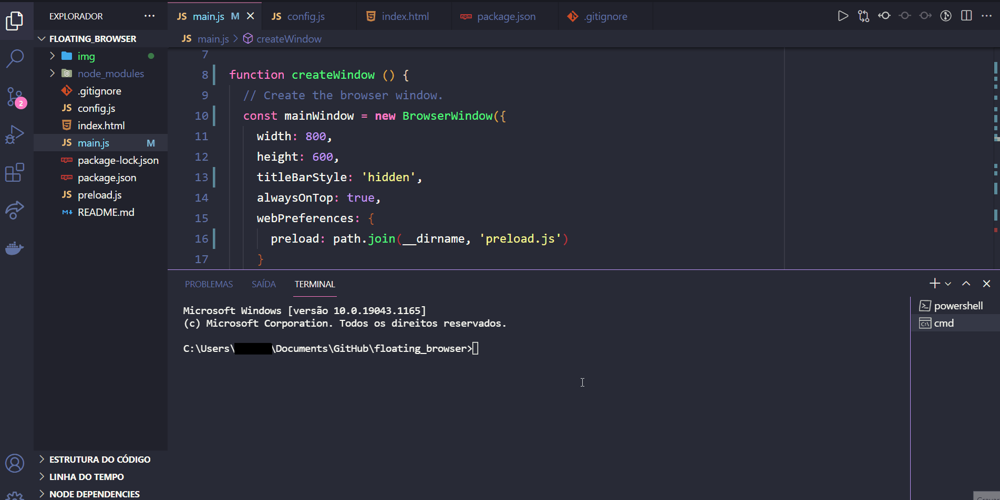

# FLOATING BROWSER

Application made using Electron JS. Floating browser designed to be used as a preview of pages while I'm programming. It will always stay above your screens, in my case, I use it above vscode.

 
HOW TO USE: after cloning the repository, execute the following commands below in your terminal
 
 
<pre>
  <code>
    npm install
    npm start
  </code>
</pre>

 

GIF

 
